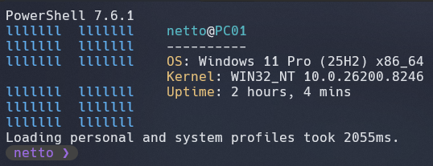
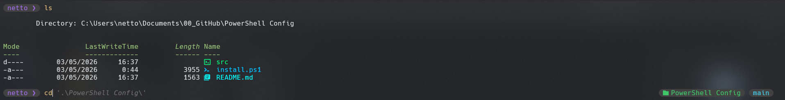

# 🚀 PowerShell ZSH-Style (P10K Look)


Este repositorio contiene un script de automatización para transformar tu **PowerShell** clásico en una terminal moderna, rápida y estética, inspirada en el popular tema **Powerlevel10k** de ZSH.

---

## 📸 Capturas de Pantalla

| Inicio con Fastfetch | Autocompletado y Temas |
| :---: | :---: |
|  |  |

> *Personalización con burbujas redondeadas y soporte para iconos Nerd Fonts.*

---

## ✨ Características

* ⚡ **PowerShell 7 Core**: Instalación automática de la versión más moderna y rápida.
* 🎨 **Oh My Posh**: Motor de temas para un prompt dinámico y estético.
* 📊 **Fastfetch**: Información del sistema al iniciar (minimalista y limpio).
* 🔍 **Autocompletado**: Predicciones estilo ZSH basadas en tu historial de comandos.
* 📁 **Terminal-Icons**: Iconos coloridos para carpetas y archivos al navegar.
* 🔡 **Hack Nerd Font**: Instalación automática de la fuente necesaria para glifos e iconos.
* 🐧 **Linux Aliases**: Usa comandos como `la`, `ll`, `l` y `config` como en Bash/Zsh.

---

## 🔍 ¿Qué hace este script?

El script de instalación realiza una configuración integral del entorno:

1.  **Entorno Core**: Verifica si usas PowerShell 7 (basado en .NET), optimizado para rendimiento.
2.  **Motor de Renderizado**: Configura `Oh My Posh` para inyectar segmentos visuales (ANSI) con información en tiempo real.
3.  **Gestión de Fuentes**: Descarga e instala glifos de `Nerd Fonts`. Sin esto, los iconos se verían como cuadros vacíos.
4.  **Capa de Compatibilidad (POSIX)**: Crea un puente de comandos para que los usuarios de Linux se sientan como en casa.
5.  **Persistencia**: Automatiza la creación del archivo `$PROFILE`, asegurando que la configuración cargue en cada sesión.

---

## 🖥️ Compatibilidad

Este script ha sido testeado para los siguientes entornos:

* **Windows 11**: Compatibilidad nativa completa (Recomendado).
* **Windows 10 (20H2 o superior)**: Soporta todas las características.
* **Windows 10 LTSC / Enterprise**: Compatible (requiere `winget` instalado).
* **Windows Terminal**: Se recomienda su uso para una mejor renderización de transparencias y colores.

---

## 🛠️ Instalación Rápida

Para instalar todo automáticamente (fuentes, módulos y configuración), abre PowerShell como **Administrador** y ejecuta el siguiente comando:

```powershell
Set-ExecutionPolicy Bypass -Scope Process -Force; [System.Net.ServicePointManager]::SecurityProtocol = [System.Net.SecurityProtocolType]::Tls12; iwr -useb https://raw.githubusercontent.com/TentacionStyle/PowerShell-Config/main/install.ps1 | iex